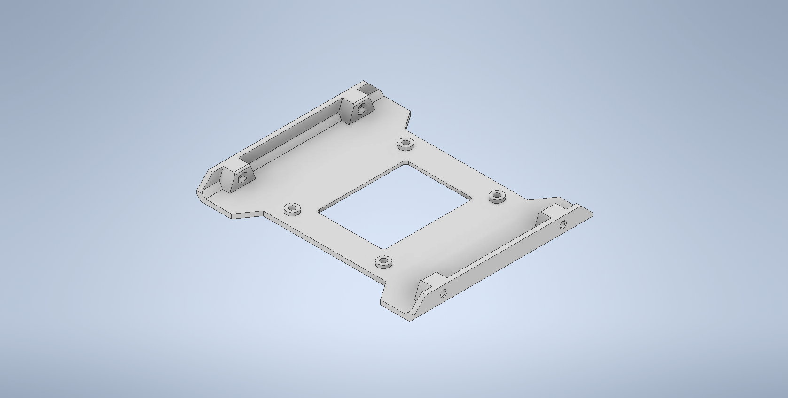

# 5.25" Bay Converter

<table>
  <tr>
    <td>
      <b>Inventor (2022)</b>
    </td>
    <td>
      <b>Production</b>
    </td>
  </tr>
  <tr>
    <td>
      
    </td>
    <td>
    
    </td>
  </tr>
</table>

## About

This model is intended to convert a 5.25" bay inside a computer case to be able to mount a 2.5"
SSD/HDD.

In modern computers, there is no demand for these larger bay drives. This addresses this issue by
converting the bay into something useful.

The choice was to use an embedded nut as the mounting solution. As most solutions use self-threading
screws, I find that this limits the number of times that the bay can be mounted/unmounted (as a
result of thread stripping).

Using nuts and bolts in the mounting process increases the lifespan of the product by not having to
carve the threads in the material.

## Printing

| Parameter       | Value      |
| --------------- | ---------- |
| Material Type   | PLA        |
| Material Weight | 44g        |
| Layer Height    | 0.2mm      |
| Printing Time   | 6.00 Hours |
| Printer Model   | Ender3 V2  |

## Improvements

-   Possibility to reduce the amount of material used. Cutouts can clear out the unnecessary surface
    area.
